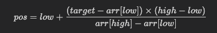

# Interpolation Search

Interpolation Search is a searching algorithm for sorted arrays. It is used when the array values are uniformly distributed.

## Idea

Unlike linear search, which checks one element at a time, interpolation search estimates the position of the target value based on its value range.

It tries to guess where the target should be in the array instead of always checking the middle element.

## Formula

The estimated position is calculated as:

pos = low + [ (target - arr[low]) * (high - low) ] / [ arr[high] - arr[low] ]

Where:

- Numerator = (target - arr[low]) * (high - low)
- Denominator = arr[high] - arr[low]
- low = starting index
- high = ending index
- target = value to search
- arr[low] and arr[high] are the values at the ends of the current search range

This means:

- The numerator tells how far the target is from the lower bound value
- The denominator tells the total value range between the two ends
- The ratio helps estimate where the target should be in the array

## How it works

1. Start with low = 0 and high = n - 1
2. Compute the probable position using the formula
3. If arr[pos] == target, return pos
4. If target < arr[pos], search left side
5. If target > arr[pos], search right side
6. Repeat until target is found or the range becomes empty

## Example

Suppose the array is:

[10, 20, 30, 40, 50, 60, 70, 80]

We want to search for 60.

- low = 0, high = 7
- target = 60
- arr[low] = 10, arr[high] = 80
- The formula gives a position near the middle/right side
- The algorithm quickly narrows to the correct area and finds 60

## Time Complexity

- Best case: O(1)
- Average case: O(log log n) for uniformly distributed data
- Worst case: O(n)

## Space Complexity

- O(1)

## Advantages

- Very fast for uniformly distributed data
- Better than linear search in many practical cases
- Efficient for large sorted arrays

## Disadvantages

- Works only for sorted arrays
- Works best when values are evenly spread
- In worst case, it can become O(n)

## Summary

Interpolation Search is a smart search technique for sorted arrays that estimates where the target value might be, instead of checking each element or always going to the middle. It is faster than linear search in suitable datasets, but it is not always better than binary search.
